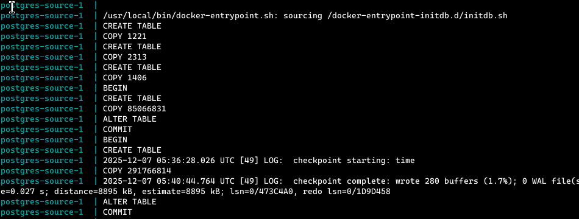
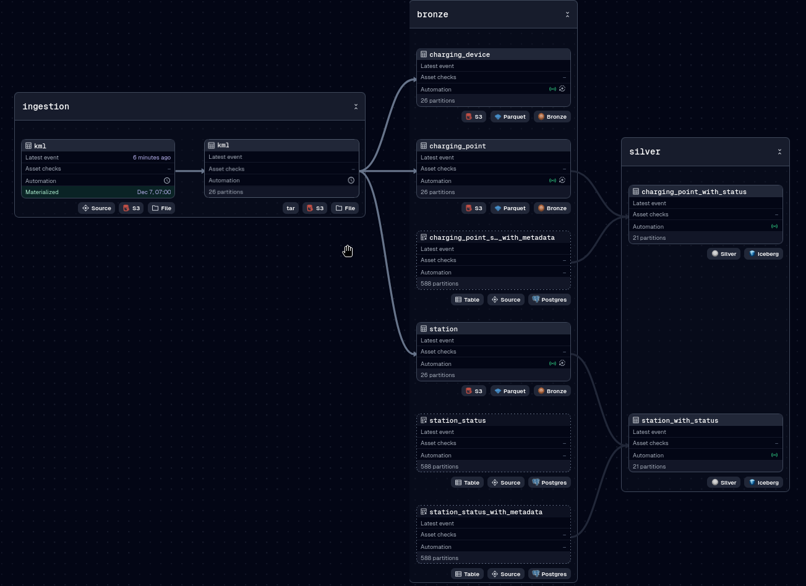
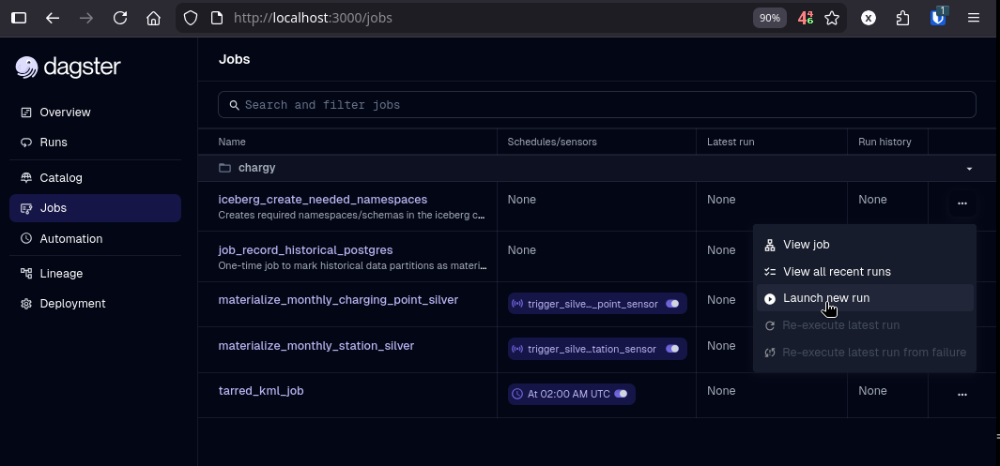
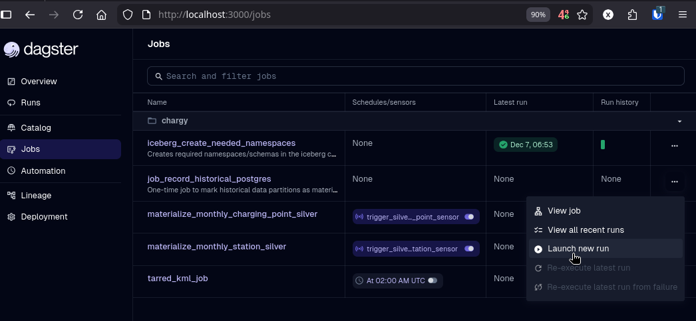
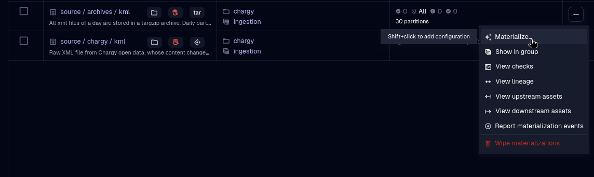
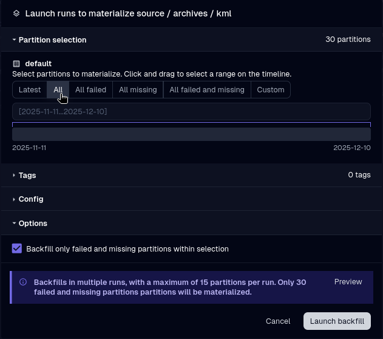

= The Data-Platform on Docker Compose
Xavier REVEILLON
v0.1, 2025-12-06: First publication
:description: How to start a data-platform in a one-line command, and load it with a few clicks
:toc:
:toc-placement!:

My first version of the data-platform (not fully developed), was using Kubernetes, Helm and Helmfile to build it up. While it was instructiog the users in the inner working of the tools, it was not straightforward to get it running. Now I'm proposing to use Docker Compose, and allowing to use a one-line command to start it.

toc::[]

== The platform content

=== Components

The platform make use of several components :
* Postgresql: for component databases (Dagster, Nessie) and for source data
* MinIO: For S3 storage, for source data, as well as for parquet and iceberg data
* Dagster: as data orchestrator
* Nessie: as Iceberg Catalog
* Trino: as Compute Engine
* In the future:
** Superset as a visualization tool
** OpenMetadata as a data catalog

=== The data

In Luxembourg, the company Chargy is providing "IRVE" (Infrastructure de recharge pour véhicules électriques, in English Electric Vehicle Charging Infrastructure "EVCI"). It is also providing open data on the usage of its stations, in the form of a https://data.public.lu/fr/datasets/bornes-de-chargement-publiques-pour-voitures-electriques/[KML file], updated every 5 minutes.

As a side-project, I was storing its content in a PostgreSQL database, with some compiled Talend job sheduled as a Docker job, for one year and a half. Now, I'm using Dagster to store it in a MinIO bucket.

In this data-platform, I'm providing the historical data in a postgres-source container, containing the full 18 months of data. As it's using 35 GB of storage, the timeframe is customizable. I'm also providing the current S3 content in the MinIO container.

The end-goal is to extract some useful metrics such as:
* is the number of EV growing?
* how much energy is needed by all EV?
* are the stations well located?
* what are the charging habits (evenings, weekends, holidays, ...)?

== Some configuration before-hand

=== Clone the repo

.Clone the repo and get into it
[source,bash]
----
git clone --branch docker-compose --depth 1 --single-branch github.com/xreveillon/data-platform-demo.git
cd data-platform-demo
----

=== Group id of docker

I configured Dagster to run every job in a docker container. For this to work in a non-root manner, dagster needs to be run with a user in the docker group.

.First, let's find the gid:
[source,bash]
----
export DOCKER_GROUP_GID=$(getent group docker | cut -d: -f 3)
----

And let's report this gid in the file ./dagster-workspace/.env

[source,bash]
----
sed -i "s#^DOCKER_GROUP_ID=.*\$#DOCKER_GROUP_ID=${DOCKER_GROUP_GID}#" ./dagster-workspace/.env
----

=== Start date of the source data in Postgres

As already said, the full source data in PostgreSQL takes 35 GB of storage. It is containing data from 2024-04-01 to 2025-11-10.

To cut roughly in half, use a start date (in YYYY-MM-DD format) as of 2025-01-01, in the file ./dagster-workspace/.env-chargy

.Choose a start data and assign it
[source,bash]
----
export START_DATE=2025-01-01
sed -i "s#^CHARGY_POSTGRES_START_DATE=.*\$#CHARGY_POSTGRES_START_DATE=${START_DATE}#"
----

== Let's start it!

[source,bash]
----
docker compose up -d
----

The source postgresql will load its own data from targzip archives included in the image, taking approximately 15 minutes for the full 35 GB.

.You can follow the process with following command
[source,bash]
----
docker compose logs -f postgres-source
----

.The process has ended when there is a "ALTER TABLE" and a "COMMIT" after the 5th "CREATE TABLE".

[source,bash]
----postgres-source-1  | CREATE TABLE
postgres-source-1  | COPY 1221
postgres-source-1  | CREATE TABLE
postgres-source-1  | COPY 2313
postgres-source-1  | CREATE TABLE
postgres-source-1  | COPY 1406
postgres-source-1  | BEGIN
postgres-source-1  | CREATE TABLE
postgres-source-1  | COPY 85066831
postgres-source-1  | ALTER TABLE
postgres-source-1  | COMMIT
postgres-source-1  | BEGIN
postgres-source-1  | CREATE TABLE
postgres-source-1  | 2025-12-07 05:36:28.026 UTC [49] LOG:  checkpoint starting: time  # Some chackpoints may happen in between
postgres-source-1  | COPY 291766814
postgres-source-1  | 2025-12-07 05:40:44.764 UTC [49] LOG:  checkpoint complete: wrote 280 buffers (1.7%); 0 WAL file(s) added, 0 removed, 0 recycled; write=254.106 s, sync=2.573 s, total=256.739 s; sync files=98, longest=2.167 s, average=0.027 s; distance=8895 kB, estimate=8895 kB; lsn=0/473C4A0, redo lsn=0/1D9D458
postgres-source-1  | ALTER TABLE
postgres-source-1  | COMMIT
----

.The services will be available at:
* Minio (S3): http://localhost:9000
* Minio (web console): http://localhost:9001
* Dagster: http://localhost:3000
* Nessie (not that it's useful to access it): http://localhost:19120
* Trino: http://localhost:8081 (Yes, 8081, because 8080 is kept for Keycloak when SSO will be added)

.http://localhost:3000/asset-groups shows the asset lineage in Dagster

== Let's load Nessie!

. At the first start, Nessie must be initialized by creating needing namespaces (≃ schemas in databses). A job exists for this in Dagster.
+
--
Let's browse to http://localhost:3000 , going into "jobs", and launch the job "iceberg_create_needed_namespaces".

Accept the default values and click "Launch run"
--

. The historical data in Postgres is not managed by Dagster. It is referenced by an "external asset" (a standalone "AssetSpec" in the code, and a dotted asset in the UI), and dagster does not know that it is already materialized. Let's launch the job "job_record_historical_postgres"
+
--

--

. In parallel, let's launch the materializations of some assets for data stored on S3.
+
--
.Still on Dagster at http://localhost:3000 , go to "Catalog", and select "materialize" on the asset "source / archive / kml"

.You can select all partitions and "Launch" the backfill.

--

. Wait for the coded automations to do its work, and automatically refresh downstream assets

== Meanwhile, some description of dagster

In dagster, code and objects can be categorized into 3 subjects: infrastructure (dagster components), asset definitions, automation

=== Infrastructure

Dagster is composed of five main components, whose goals are to define the assets, provide a frontend, launch the jobs...

==== Database

The database (in my case, I chose Postgres), is the central point of communication between all the components. It stores all metadata of jobs. It is accessed by the webserver, the daemon, the  job workers.

In the compose file, it is the service dagster-postgresql

==== Daemon

In each deployment of dagster, there can be only one daemon. Its main role is to launch the workers, according to the chosen coordinator (every job should run as soon as it is defined, or launch maximum n jobs in parallel, the others will wait). Its configuration is in the files dagster.yaml (infrastructure) and workspace.yaml (for "code locations" (see below)).

==== Webserver

It provides a web frontend to Dagster. It has the same configuration files as the daemon.

==== Code location

That is where the asset definitions reside. It is accessed by the webserver and the daemon via GRPC.

==== The "workers", or Launchers and Executors in dagster terms

These are the actual workforce for the data assets. Several run launchers can be defined (via containers, kubernetes pods, or simply processes). In this repo, jobs are run in Docker containers. The image built for the code location is also used to create the job containers.

=== In the code location reside the assets definitions

Dagster provides several object classes to not only define assets but also simplify the development of the asset

==== Asset

Main component of an asset project, it is defined by a simple function, whose role is to define the content, the data, of the asset.

==== IO Managers

A dagster project can work without IO managers. But when several assets are using the same mechanism to persist the data, defining the persistance in an IO manager is very useful. That way, all an asset function has to do is "return" the data of the asset, and the IO manager is in charge of persisting. The same way, when there are dependencies between assets, the IO Manager is in charge of getting the data from an upstream asset, and the data is provided to downstream assets as arguments to the function.

.Example taken from dagster docs, https://docs.dagster.io/guides/build/assets/passing-data-between-assets#move-data-between-assets-implicitly-using-io-managers
[source,python]
----
import pandas as pd
from dagster_duckdb_pandas import DuckDBPandasIOManager

import dagster as dg

duckdb_io_manager = DuckDBPandasIOManager(
    database="my_database.duckdb", schema="my_schema"
)

@dg.asset
def people():
    return pd.DataFrame({"id": [1, 2, 3], "name": ["Alice", "Bob", "Charlie"]})

@dg.asset
def birds():
    return pd.DataFrame({"id": [1, 2, 3], "name": ["Bluebird", "Robin", "Eagle"]})

@dg.asset
def combined_data(people, birds):
    return pd.concat([people, birds])

@dg.definitions
def resources():
    return dg.Definitions(
        resources={"io_manager": duckdb_io_manager},
    )
----

==== (configurable) Resources

Resources can be defined to store connections/credentials to databases, filesystems, clouds, .... and can be used by IO Managers, assets, ...

=== Automation

Once the assets are defined, the materializations can be automated with 3 simple components

==== Jobs/Ops

By means of jobs and ops, often hidden/not needed to be manually defined, the assets are materialized. Sometimes, the materializations of assets can be grouped and executed by one job.

==== Schedules

Schedules are the planning part of dagster, for periodic assets.

==== Sensors

When the materialization of an asset is not regular/periodic, the sensors come into play. A sensor is a piece of code, run periodically, that checks if the conditions are met to meterialize an asset, and only then a "RunRequest" is sent, that will be interpreted by the Daemon.

And there are so many other concepts in Dagster that make developing data projects so much easier. The IO Manager, from my point of view, is the most important in separating the definition of an asset and dependencies from its persistance.
